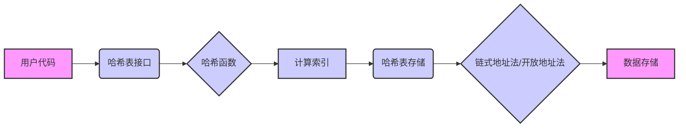
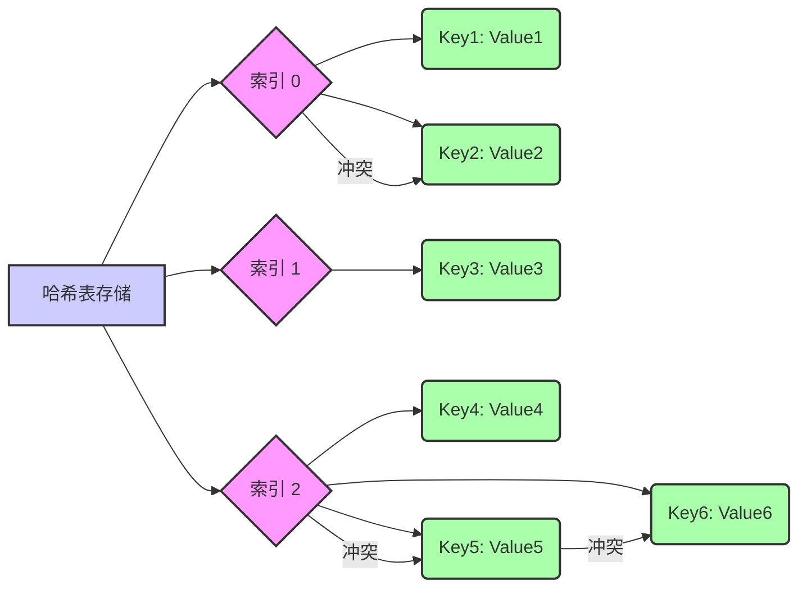

# 从头开始实现一个 C 语言哈希表

## 1. 简介

哈希表（Hash Table），也称为散列表，是一种非常重要的数据结构，它提供了快速的插入、查找和删除操作。 哈希表通过将键（Key）映射到表中一个位置来访问记录，这个映射过程叫做哈希函数（Hash Function）。

本文将指导你从头开始使用 C 语言实现一个简单的哈希表，不依赖任何外部库。

## 2. 哈希表的基本概念

*   **键（Key）：** 用于标识存储数据的唯一标识符。
*   **值（Value）：** 与键相关联的数据。
*   **哈希函数（Hash Function）：** 将键转换为哈希表索引的函数。 好的哈希函数应该尽量减少冲突。
*   **哈希冲突（Hash Collision）：** 当两个或多个键被哈希到同一个索引时发生。
*   **冲突解决方法：** 解决哈希冲突的方法，常见的有链式地址法和开放地址法。
    *   **链式地址法（Separate Chaining）：** 将所有哈希到同一个索引的键值对存储在一个链表中。
    *   **开放地址法（Open Addressing）：** 当发生冲突时，尝试在哈希表中寻找下一个可用的空槽。

## 3. 设计

### 3.1 数据结构

我们将使用以下数据结构来实现哈希表：

```c  
typedef struct HashItem {  
    char* key;        // 键，使用字符串  
    void* value;      // 值，使用 void* 可以存储任意类型  
    struct HashItem* next; // 指向链表中下一个元素的指针 (用于链式地址法)  
} HashItem;  

typedef struct HashTable {  
    int size;           // 哈希表的大小 (容量)  
    HashItem** table;    // 指向 HashItem 指针的指针，即哈希表本身  
} HashTable;
```





